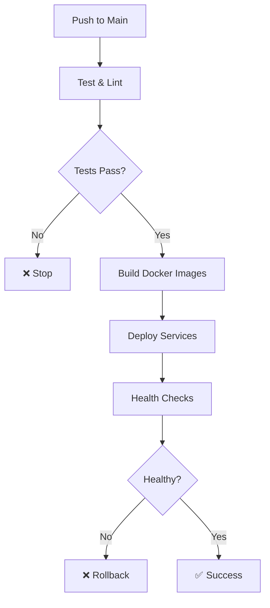

# 🚀 GitHub Actions Workflows

This document explains the GitHub Actions workflows configured for the portfolio project.

## 📋 Available Workflows

### 1. 🧪 Test Portfolio (`test.yml`)
**Trigger**: Pull Requests, Manual Dispatch  
**Purpose**: Fast testing and linting for development

**Jobs**:
- **🟢 Test Frontend**: Lint and build Next.js application
- **🐍 Test Backend**: Lint Python FastAPI code  
- **🐳 Test Docker Build**: (Manual only) Test Docker image builds
- **📋 Test Summary**: Overall test results

**Usage**:
```bash
# Automatically runs on PRs
# Manual trigger via GitHub Actions tab
```

### 2. 🚀 Deploy Portfolio (`deploy-portfolio.yml`)
**Trigger**: Push to main, Manual Dispatch  
**Purpose**: Full deployment pipeline with local Docker builds

**Jobs**:
- **🧪 Test & Lint**: Comprehensive testing (GitHub runners)
- **🐳 Build Docker Images**: Local Docker builds (Self-hosted runners)
- **🚀 Deploy Services**: Service deployment and health checks
- **📢 Notify Result**: Deployment notifications

**Features**:
- ✅ **No Registry Dependencies** - Builds locally only
- ✅ **Comprehensive Health Checks** - Ensures services are running
- ✅ **Image Cleanup** - Manages old Docker images
- ✅ **Multiple Tags** - Tags with latest, commit SHA, and timestamp
- ✅ **Force Rebuild Option** - Clean rebuild when needed
- ✅ **Environment Support** - Production, staging, local

## 🔧 Configuration

### Self-Hosted Runner Requirements

For the deployment workflow to work, you need a self-hosted GitHub Actions runner with:

1. **Docker** installed and running
2. **Docker Compose** installed
3. **curl** for health checks
4. **git** for repository access

### Setting Up Self-Hosted Runner

1. **On your server/local machine**:
   ```bash
   # Navigate to GitHub repo → Settings → Actions → Runners
   # Click "New self-hosted runner"
   # Follow the setup instructions
   ```

2. **Verify setup**:
   ```bash
   docker --version
   docker-compose --version
   curl --version
   ```

### Environment Variables

The workflows use these environment variables:
- `NODE_VERSION: '20'` - Node.js version
- `PYTHON_VERSION: '3.11'` - Python version

## 🎮 Manual Triggers

### Deploy Workflow Options:
- **Environment**: Choose production, staging, or local
- **Force Rebuild**: Clean rebuild of Docker images

### Test Workflow Options:
- **Docker Build Test**: Optionally test Docker builds

## 🚦 Workflow Behavior

### On Pull Request:
- ✅ Runs test workflow only
- ✅ Tests frontend build and linting
- ✅ Tests backend linting
- ❌ No deployment

### On Push to Main:
- ✅ Runs full deployment workflow
- ✅ Tests → Builds → Deploys → Notifies
- ✅ Uses self-hosted runner for build/deploy

### On Manual Trigger:
- ✅ Allows custom environment selection
- ✅ Option to force rebuild
- ✅ Can trigger from any branch

## 📊 Workflow Status

Monitor workflow status:
- **GitHub Actions Tab**: Real-time logs and status
- **Local Logs**: `./scripts/manage-portfolio.sh logs`
- **Health Endpoint**: http://localhost:5950/health

## 🛠️ Troubleshooting

### Common Issues:

#### 1. Self-Hosted Runner Offline
```bash
# Check runner status
./run.sh

# Or restart runner service
sudo systemctl restart actions.runner.*
```

#### 2. Docker Build Failures
```bash
# Check Docker daemon
docker info

# Clean Docker environment
docker system prune -a
```

#### 3. Service Health Checks Fail
```bash
# Check service logs
./scripts/manage-portfolio.sh logs

# Manual health check
curl http://localhost:3000
curl http://localhost:5950/health
```

#### 4. Permission Issues
```bash
# Ensure runner user has Docker permissions
sudo usermod -aG docker $USER

# Verify docker-compose permissions
ls -la docker-compose.yml
```

## 🔄 Deployment Flow



## 📈 Benefits

### Compared to Registry-Based Approach:
- ✅ **No External Dependencies** - No registry permissions needed
- ✅ **Faster Builds** - No push/pull overhead  
- ✅ **Cost Effective** - No registry storage costs
- ✅ **Offline Capability** - Works without internet
- ✅ **Complete Control** - Full image management

### Security:
- ✅ **Local Images Only** - No exposure to public registries
- ✅ **Controlled Environment** - Self-hosted runner security
- ✅ **No Registry Tokens** - No external authentication

## 📝 Workflow Files

### Active Workflows:
- `.github/workflows/test.yml` - Testing workflow
- `.github/workflows/deploy-portfolio.yml` - Deployment workflow

### Disabled Workflows:
- `.github/workflows/deploy.yml.disabled` - Old registry-based deployment
- `.github/workflows/main.yml.disabled` - Old Nixpacks deployment
- `.github/workflows/manual-deploy.yml.disabled` - Old manual deployment

## 🔧 Customization

### Adding New Environments:
```yaml
# In deploy-portfolio.yml
environment:
  description: 'Deployment environment'
  options:
  - production
  - staging
  - local
  - development  # Add new environment
```

### Modifying Build Process:
```yaml
# Add custom build steps
- name: 🔧 Custom Build Step
  run: |
    echo "Add your custom logic here"
```

### Health Check Customization:
```bash
# Modify health check logic in deploy job
check_service "Custom Service" "http://localhost:8080/health"
```

This setup provides a robust, local-first deployment pipeline that scales from development to production! 🚀
