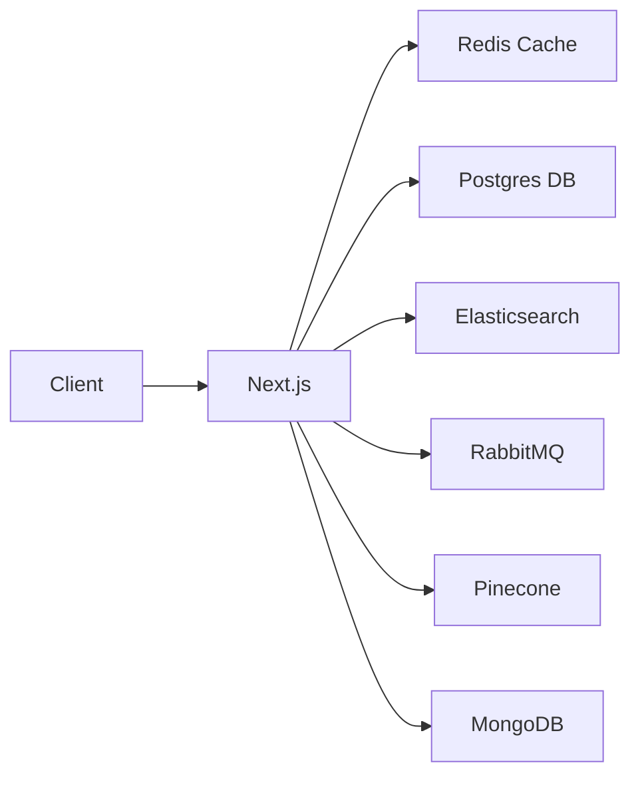

## The Database That Ate the World

PostgreSQL is no longer just a relational database. With its extension ecosystem, it has become a **universal data platform** that can replace half a dozen specialized services.

The pitch is simple: instead of running Postgres + Redis + MongoDB + Elasticsearch + RabbitMQ + a vector database, you can run **just Postgres** with extensions.

## The Extension Ecosystem

### pgvector — Vector Search

Semantic search, RAG embeddings, and recommendation engines without a separate vector database:

```sql
CREATE EXTENSION vector;

CREATE TABLE documents (
  id SERIAL PRIMARY KEY,
  content TEXT,
  embedding VECTOR(1536)  -- OpenAI embedding dimension
);

-- Search by semantic similarity
SELECT content, 1 - (embedding <=> '[0.01, -0.02, ...]') AS similarity
FROM documents
ORDER BY embedding <=> '[0.01, -0.02, ...]'
LIMIT 5;

-- With an IVFFlat index for speed
CREATE INDEX ON documents USING ivfflat (embedding vector_cosine_ops)
  WITH (lists = 100);
```

**Replaces**: Pinecone, Weaviate, Qdrant, Milvus

### pg_cron — Scheduled Jobs

No more external cron daemons or scheduled workers:

```sql
CREATE EXTENSION pg_cron;

-- Vacuum every night
SELECT cron.schedule('nightly-vacuum', '0 3 * * *',
  'VACUUM ANALYZE');

-- Clean up expired sessions every hour
SELECT cron.schedule('cleanup-sessions', '0 * * * *',
  $$DELETE FROM sessions WHERE expires_at < NOW()$$);

-- Send digest emails daily
SELECT cron.schedule('daily-digest', '0 8 * * *',
  $$SELECT send_digest_emails()$$);
```

**Replaces**: cron, Sidekiq, Celery beat, AWS EventBridge

### pg_later — Async Queries

Fire-and-forget queries that execute in the background:

```sql
SELECT pg_later.submit($$REFRESH MATERIALIZED VIEW analytics_mv$$);
SELECT pg_later.submit(
  $$UPDATE users SET reputation = compute_reputation(id) WHERE id = $1$$,
  ARRAY['123e4567']
);
```

**Replaces**: Background job queues, Celery, BullMQ

### pgmq — Message Queues

A full-featured message queue inside Postgres:

```sql
CREATE EXTENSION pgmq;

-- Create a queue
SELECT pgmq.create('email_queue');

-- Send messages
SELECT pgmq.send('email_queue',
  '{"to": "user@example.com", "subject": "Welcome!"}');

-- Receive (with visibility timeout)
SELECT pgmq.read('email_queue', 60, 5);

-- Delete after processing
SELECT pgmq.delete('email_queue', msg_id);

-- Archive for audit
SELECT pgmq.archive('email_queue', msg_id);
```

**Replaces**: RabbitMQ, Redis pub/sub, SQS, NATS

### pg_analytics — Columnar Storage

Analytics queries on Postgres data with DuckDB-compatible performance:

```sql
CREATE EXTENSION pg_analytics;

-- Convert a table to columnar format
ALTER TABLE events SET ACCESS METHOD columnar;

-- Run OLAP queries at columnar speed
SELECT DATE_TRUNC('day', created_at), COUNT(*), AVG(revenue)
FROM events
GROUP BY 1
ORDER BY 1 DESC;
```

**Replaces**: ClickHouse, Snowflake, Redshift (for many workloads)

### PostGIS — Geospatial

The gold standard for spatial data:

```sql
CREATE EXTENSION postgis;

SELECT name, ST_Distance(
  location,
  ST_SetSRID(ST_MakePoint(-73.985, 40.748), 4326)
) AS distance
FROM landmarks
ORDER BY location <-> ST_SetSRID(ST_MakePoint(-73.985, 40.748), 4326)
LIMIT 10;
```

**Replaces**: MongoDB GeoJSON, Elasticsearch Geo, dedicated GIS servers

### hstore + JSONB — Document Store

NoSQL-style flexible schemas alongside relational data:

```sql
CREATE TABLE products (
  id SERIAL PRIMARY KEY,
  name TEXT NOT NULL,
  attributes JSONB,
  metadata HSTORE
);

-- Index any JSON path
CREATE INDEX ON products USING GIN (attributes jsonb_path_ops);

-- Query deep into documents
SELECT * FROM products
WHERE attributes @> '{"category": "electronics", "specs": {"wifi": "6E"}}';
```

**Replaces**: MongoDB, Firebase, DynamoDB (for document workloads)

## Putting It Together

### The Stack Before



Six infrastructure services to manage, backup, monitor, and scale.

### The Stack After


One database. One backup strategy. One monitoring dashboard.

## The Consolidation Map

| Service | Extensions | Protocol |
|---|---|---|
| MongoDB | `jsonb`, `btree_gin` | Native JSON + GIN indexes |
| Redis Cache | `pg_bm25`, `pg_lru` | Built-in caching + BM25 search |
| Redis Pub/Sub | `pgmq`, `LISTEN/NOTIFY` | Message queue + event notifications |
| RabbitMQ | `pgmq` | Persistent, SQL-managed queues |
| Elasticsearch | `pgvector`, `pg_bm25` | Full-text + vector search |
| Pinecone | `pgvector` | Vector similarity with IVFFlat / HNSW |
| Sidekiq / Celery | `pg_cron`, `pg_later` | Scheduled + background queries |
| ClickHouse | `pg_analytics` | Columnar storage for OLAP |
| Neo4j | `age` | Graph queries (Apache AGE) |
| Firebase | `jsonb` + PostgREST | REST API from Postgres schemas |

## When to Consolidate and When Not To

### Consolidate When

- **Team size is small** — fewer services = less ops burden
- **Consistency matters** — ACID transactions across features
- **Latency tolerance** — all-in-one is fast but not Redis/RabbitMQ fast
- **Deployment simplicity** — one Docker image vs. six
- **Startup / side project** — move fast, extract later

### Keep Separate When

- **Throughput exceeds Postgres limits** — 10k+ msg/s queues belong in RabbitMQ
- **Sub-millisecond cache required** — Redis is still faster for hot keys
- **Elasticsearch for full-text** — pg_bm25 is good, ES is better at scale
- **Compliance / isolation** — separate services for regulatory requirements

## Real World: My Cluster

On my K3s cluster, Postgres with these extensions powers:

```yaml
# postgres.yaml
apiVersion: apps/v1
kind: StatefulSet
metadata:
  name: postgres
spec:
  template:
    spec:
      containers:
      - name: postgres
        image: pgvector/pgvector:pg17
        env:
        - name: POSTGRES_EXTENSIONS
          value: "vector,pg_cron,pgmq,postgis,hstore,pg_analytics"
```

Running in a single 4GB LXC container — it serves as:
- Primary application database
- Full-text search engine (via GIN + pg_bm25)
- Vector store for AI embeddings
- Background job queue (pgmq)
- Scheduled task runner (pg_cron)
- Analytics store (columnar via pg_analytics)
- Cache layer (materialized views + LISTEN/NOTIFY)

## Caveats

- Postgres replication is **single-primary** — you need a connection pooler (PgBouncer) for high concurrency
- Extensions must be installed per-database
- Not all extensions are available on managed Postgres (RDS, Cloud SQL)
- Write throughput tops out around 50k-100k writes/second on a single node

## Conclusion

PostgreSQL's extension ecosystem has quietly transformed it from a relational database into an operating system for data. For most applications — especially startups, side projects, and internal tools — a single Postgres instance with the right extensions can replace your entire data infrastructure.

Fewer services means fewer failure points, simpler deployments, and more time building features instead of managing databases.
